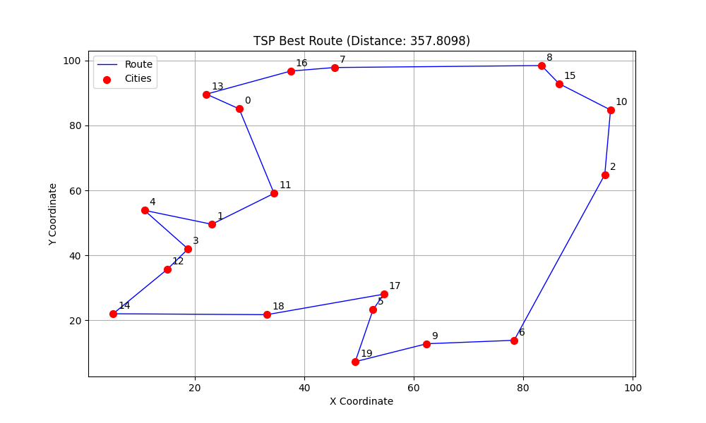

# Traveling Salesperson Problem (TSP) Solver

This is a Spring Boot application that solves the **Traveling Salesperson Problem (TSP)** using a **Genetic Algorithm** provided by the [Jenetics](https://jenetics.io/) library.

## Overview

The application generates a set of random cities and evolves a population of routes to find the shortest possible path that visits every city exactly once and returns to the start.

- **Algorithm**: Genetic Algorithm (GA)
- **Optimization Goal**: Minimize total Euclidean distance
- **Population Size**: 500
- **Generations**: 500

## Tech Stack

- **Java**: 21
- **Spring Boot**: 3.5.7
- **Jenetics**: 8.0.0 (Evolutionary Algorithm Library)

## Key Features

- **Minimization**: Correctly configured to find the shortest route.
- **Reproducibility**: Logs the random seed used for city generation, allowing for reproducible runs.
- **Visualization**: Prints the evolution progress and the final best route to the console.

## How to Run

### Prerequisites
- Java 21 or higher installed.

### Build and Run
You can run the application directly using the Maven Wrapper:

```bash
./mvnw spring-boot:run
```

Or build the JAR and run it:

```bash
./mvnw package -DskipTests
java -jar target/TSP-0.0.1-SNAPSHOT.jar
```


## Visualization

The application saves the best route and city coordinates to a JSON file, which can be visualized using the provided Python script.

### 1. Run the Java Application
First, run the application as described above. Upon completion, it will generate a results file:
- `target/tsp_result.json`

### 2. Run the Plotting Script
A Python script `plot_tsp.py` is included to generate a visual representation of the tour.

**Prerequisites:**
- Python 3.x
- Matplotlib (`pip install matplotlib`)

**Command:**
```bash
python plot_tsp.py
```

This will:
1.  Read the data from `target/tsp_result.json`.
2.  Generate a route plot.
3.  Save the image to `target/tsp_plot.png`.

 *(Note: this is a placeholder path, you can check target/tsp_plot.png after running)*

